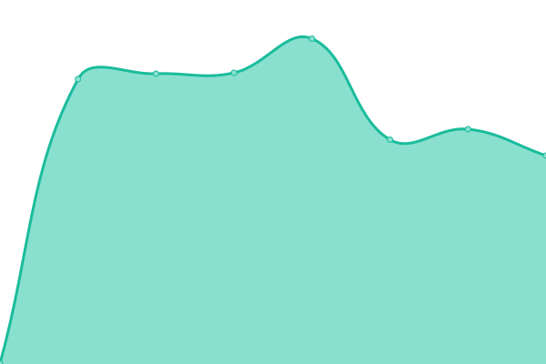
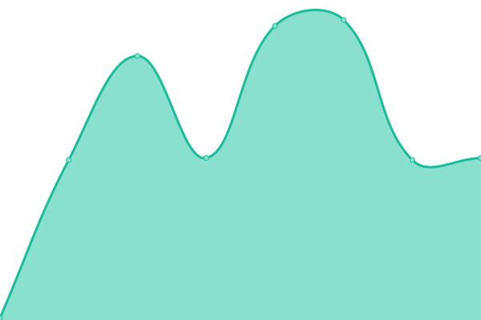
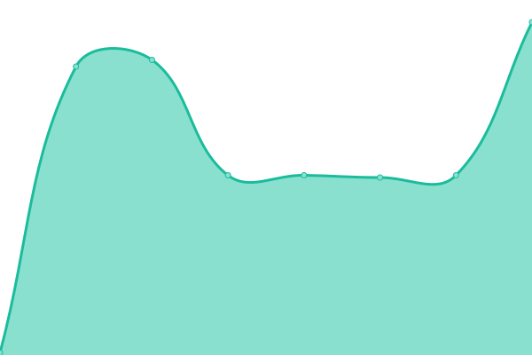
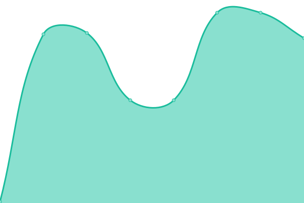

# [📈 Live Status](https://live.wilderia.fr): <!--live status--> **🟥 Complete outage**

This repository contains the open-source uptime monitor and status page for [Zekariaa](www.wilderia.fr), powered by [Upptime](https://github.com/upptime/upptime).

With [Upptime](https://upptime.js.org), you can get your own unlimited and free uptime monitor and status page, powered entirely by a GitHub repository. We use [Issues](https://github.com/Zekariaa/Wilderia/issues) as incident reports, [Actions](https://github.com/Zekariaa/Wilderia/actions) as uptime monitors, and [Pages](https://live.wilderia.fr) for the status page.

<!--start: status pages-->
<!-- This summary is generated by Upptime (https://github.com/upptime/upptime) -->
<!-- Do not edit this manually, your changes will be overwritten -->
<!-- prettier-ignore -->
| URL | Status | History | Response Time | Uptime |
| --- | ------ | ------- | ------------- | ------ |
|  [Site-web](https://wilderia.fr) | 🟥 Down | [site-web.yml](https://github.com/Zekariaa/Wilderia/commits/HEAD/history/site-web.yml) | 

 0ms
     
 | 

<a href="https://live.wilderia.fr/history/site-web">0.00%</a>
    

|  [Proxy](185.157.247.55) | 🟥 Down | [proxy.yml](https://github.com/Zekariaa/Wilderia/commits/HEAD/history/proxy.yml) | 

 0ms
     
 | 

<a href="https://live.wilderia.fr/history/proxy">0.00%</a>
    

|  [Survie](185.157.247.55) | 🟥 Down | [survie.yml](https://github.com/Zekariaa/Wilderia/commits/HEAD/history/survie.yml) | 

 0ms
     
 | 

<a href="https://live.wilderia.fr/history/survie">0.00%</a>
    

|  [Lobby](185.157.247.55) | 🟥 Down | [lobby.yml](https://github.com/Zekariaa/Wilderia/commits/HEAD/history/lobby.yml) | 

 0ms
     
 | 

<a href="https://live.wilderia.fr/history/lobby">0.00%</a>
    

|  [Bases de données](185.157.247.55) | 🟥 Down | [bases-de-donnees.yml](https://github.com/Zekariaa/Wilderia/commits/HEAD/history/bases-de-donnees.yml) | 

 0ms
     
 | 

<a href="https://live.wilderia.fr/history/bases-de-donnees">0.00%</a>
    

<!--end: status pages-->

[**Visit our status website →**](https://live.wilderia.fr)

## 📄 License

- Powered by: [Upptime](https://github.com/upptime/upptime)
- Code: [MIT](./LICENSE) © [Zekariaa](www.wilderia.fr)
- Data in the `./history` directory: [Open Database License](https://opendatacommons.org/licenses/odbl/1-0/)
